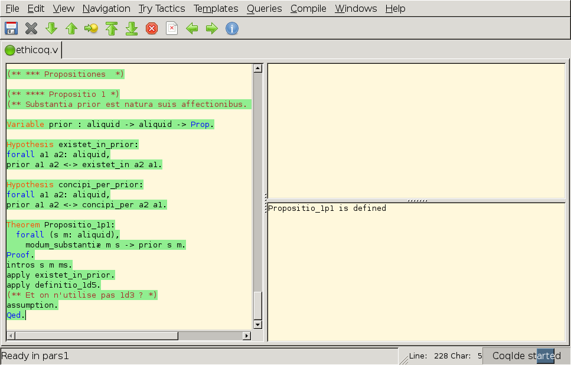
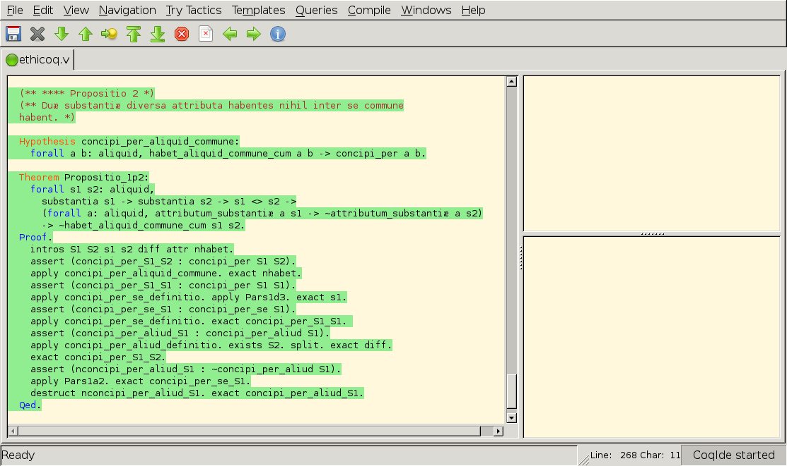

Ethicoq
=======

Ce projet est une démonstration en Coq des premières propositions de
l'_Éthique_ de Spinoza. Le cœur du programme est le fichier `ethicoq.v`.

Une première version de ce travail a été présentée le 5 juin 2015 aux
Journées scientifiques des Archives Henri-Poincaré (UMR 7117) à Nancy.

Précautions philosophiques 
--------------------------

Cette formalisation repose naturellement sur une interprétation
préalable du texte, qui reste ouverte à la discussion. Elle ne doit pas
être prise pour argent comptant.

Cette démonstration prouve encore moins que la métaphysique de Spinoza
est vraie. Elle prouve seulement que l'interprétation des thèses de
Spinoza proposée par l'auteur peut être dérivée, dans une certaine
logique, de l'interprétation qu'il propose des principes — axiomes,
définitions, postulats.

